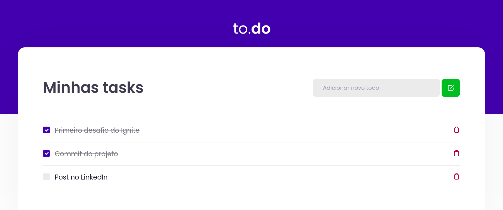

<h3 align="center">

Desafio realizado no Programa Ignite - Trilha ReactJS - da [Rocketseat], utilizando _HTML, \_CSS, \_JAVASCRIPT, \_ReactJS_ e _Typescript_.

</h3>

 

## 📚 _Sobre_

Aplicação de todolist - atividades a fazer, com foco na manipulação do estado no React.
 
 
Funcionalidades:

- Adicionar uma tarefa;
- Remover uma tarefa;
- Marcar e desmarcar uma tarefa como concluída;

 

### 📌 _Tecnologias utilizadas_

- [React](https://reactjs.org/)
- [Yarn](https://yarnpkg.com/)
- [Sass](https://sass-lang.com/)
- [Webpack](https://webpack.js.org/)
- [Babel](https://babeljs.io/)
- [TypeScript](https://www.typescriptlang.org/)

 
 

### 🚀 _Mão na massa_

bash

# Clone este repositório

$ git clone https://github.com/felipepxavier/ignite-challenge-01

# Acesse a pasta do projeto no terminal/cmd

$ cd ignite-challenge-01

# Instale as dependências

$ yarn

# Execute a aplicação em modo de desenvolvimento

$ yarn dev

 
 

<h3 align="center">
Feito com 💜 por <a href="https://www.linkedin.com/in/felipe-pedroso-04a648160/">Felipe Pedroso</a>
  

  
</a>
</h3>

<!-- Links -->

[rocketseat]: https://rocketseat.com.br/
